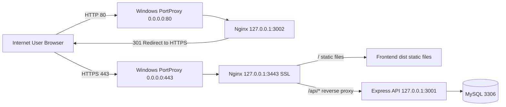

# 网络部署图说明

更新时间：2026-07-02
适用环境：wise-borders.com 当前线上部署（Windows + Nginx + Node.js）

## 1. 部署拓扑总览



## 2. 端口设计

### 对外暴露端口（公网可达）

- 80
- 443

### 内部服务端口（仅本机回环）

- 3001：Express API
- 3002：Nginx HTTP 本地入口（由 80 转发）
- 3443：Nginx HTTPS 本地入口（由 443 转发）

## 3. 端口转发与反向代理规则

### Windows PortProxy

- 0.0.0.0:80 -> 127.0.0.1:3002
- 0.0.0.0:443 -> 127.0.0.1:3443

### Nginx

- 127.0.0.1:3002
  - 仅处理 HTTP 入口
  - 统一 301 跳转到 HTTPS
- 127.0.0.1:3443
  - 托管前端静态资源（dist）
  - /api/ 反向代理到 127.0.0.1:3001
  - SPA 路由回退到 index.html

## 4. 登录与 API 请求链路（同域）

1. 浏览器访问 https://wise-borders.com
2. 前端页面由 Nginx 提供静态资源
3. 前端发起 /api/admin/login 等请求
4. Nginx 将 /api/* 转发到 127.0.0.1:3001
5. API 返回会话 Cookie 与业务数据

说明：同域 /api 设计可避免跨域问题，Cookie 和 CSRF 策略更稳定。

## 5. 当前连通性验证结果（2026-07-02）

### wise-borders.com 端口探测

- 80：可达
- 443：可达
- 3001：不可达
- 3002：不可达
- 3443：不可达

### 服务器内网地址 172.31.11.134 端口探测

- 80：可达
- 443：可达
- 3001：不可达
- 3002：不可达
- 3443：不可达

结论：已符合最小暴露面原则，仅开放 80/443。

## 6. 安全基线建议

- 保持公网仅开放 80/443。
- 3001/3002/3443 仅本机监听，禁止公网入站。
- 变更防火墙或端口映射前先做备份。
- 每次重启服务后执行一次端口探测复核。

## 7. 运维复核命令（PowerShell）

```powershell
# 1) 查看端口转发
netsh interface portproxy show all

# 2) 查看关键监听端口
Get-NetTCPConnection -State Listen |
  Where-Object { $_.LocalPort -in @(80,443,3001,3002,3443) } |
  Select-Object LocalAddress,LocalPort,OwningProcess

# 3) 检查域名端口可达性
$ports=@(80,443,3001,3002,3443)
foreach($p in $ports){
  Test-NetConnection -ComputerName wise-borders.com -Port $p -WarningAction SilentlyContinue |
    Select-Object ComputerName,RemotePort,TcpTestSucceeded
}
```

## 8. 多项目共存防冲突设计（ADMIN + MH5）

### 目标

- 全机只保留一个 80/443 网关入口。
- 每个项目只管理自己的 API 进程和日志。
- 禁止项目脚本互相停止对方的端口或 Nginx。

### 推荐端口分配

| 项目 | 对外入口 | 本机 HTTP | 本机 HTTPS | API |
|---|---|---|---|---|
| ADMIN | 80/443（统一网关） | 3002 | 3443 | 3001 |
| MH5 | 80/443（统一网关） | 不单独暴露 | 不单独暴露 | 3101（示例） |

说明：

- 80/443 由全局 Nginx 统一监听并按域名分流。
- 项目内部端口不允许重复。
- 除 80/443 外，端口均建议绑定 127.0.0.1。

### 脚本职责边界（已落地）

- `scripts/start-services.ps1`：仅管理本项目 API（3001），不再 stop/start 全局 Nginx。
- `scripts/stop-services.ps1`：仅停止本项目 `api.pid` 记录的进程。

### 变更前检查清单

1. 检查目标端口是否已被其他项目占用。
2. 检查 Nginx 配置中的 `server_name` 是否唯一且指向正确 upstream。
3. 检查防火墙是否仅开放 80/443。
4. 做好 portproxy 与防火墙规则备份再执行变更。
